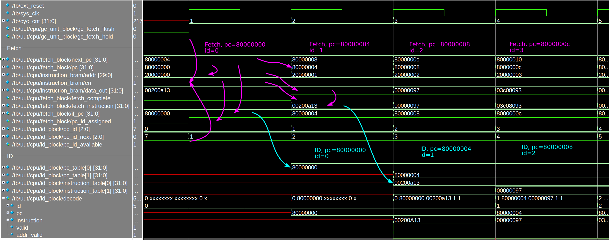
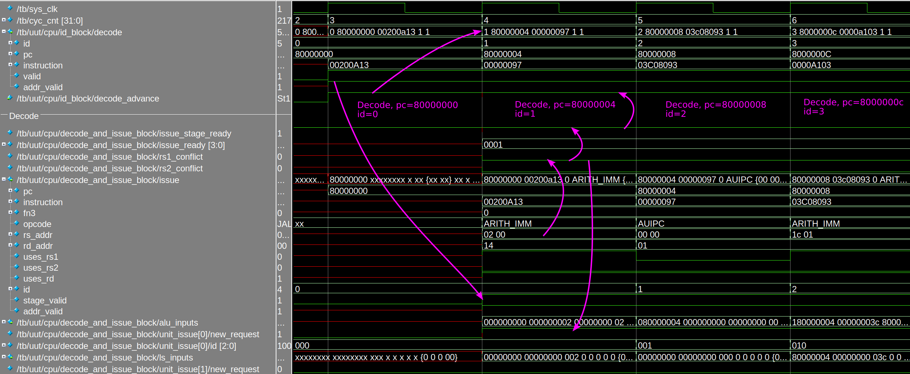
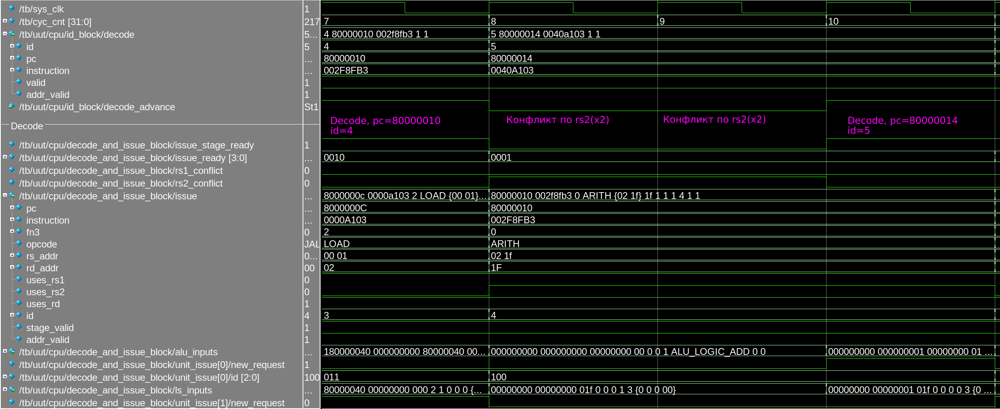

= Лабораторная работа №1. Изучение принципов работы микропроцессорного ядра RISC-V.
:example-caption: Пример
:figure-caption: Рисунок
:source-highlighter: highlight.js

== Введение

== Цели работы
Основной целью работы является ознакомление с принципами функционирования,
построения и особенностями архитектуры суперскалярных конвеерных микропроцессоров.
Дополнительной целью работы является знакомство с принципами проектирования и
верификации сложных цифровых устройств с использованием языка описания аппаратуры
SystemVerilog и ПЛИС.

== Используемые средства
Для достижения поставленных целей в настоящей лабораторной работе
используется синтезируемое описание микропроцессорного ядра
Taiga (https://gitlab.com/sfu-rcl/Taiga, авторы - Eric Matthews,  Lesley Shannon),
реализующего систему команд RV32I семейства RISC-V. Данное описание выполнено
на языке описания аппаратуры SystemVerilog

В ходе лабораторной работы используется средство моделирования MentorGraphics Modelsim для
моделирования работы исследуемого микропроцессора в процессе выполнения программы и
наблюдения формы внутренних сигналов.

Для работы с проектом используется САПР Intel Quartus.

== Архитектура набора команд RV32I

RISC-V является открытым современным набором команд, который может использоваться для
построения как микроконтроллеров, так и высокопроизводительных микропроцессоров.
В связи с такой широкой областью применния в систему команд введена вариативность.
Таким образом, термин RISC-V фактически является названием для семейства раличных систем
команд, которые строятся вокруг базового набора команд, путем внесения в него различных расширений.

В данной работе исследуется набор команд RV32I, который включает в себя основные
команды 32-битной целочисленной арифметики кроме умножения и деления. В рамках
данного набора команд мы не будем рассматривать системные команды, связанные с
таймерами, системными регистрами, управлением привилегиями, прерываниями и исключениями.

В настоящем разделе описывается *архитектура набора команд*, то есть архитектура
абстрактной вычислительной машины с точки зрения набора команд без связи с
конкретной аппратной реализацией.

=== Регистровая модель

Наборк команд RV32I предполагает использование *32 регистров общего назначения x0-x31 размером в 32 бита каждый*
и регистр *pc*, хранящего адрес следующей команды. Все регистры общего назначения
равноправны, в любой команде могут использоваться любые из регистров. Регистр `pc`
не может использоваться в командах.

IMPORTANT: Регистр `x0` всегда содержит значение 0.
Запись в него не производит никакого эффекта.

NOTE: Существует соглашение, предполагающее
использование некоторых регистров для определенных целей (например, для передачи аргументов
при вызове функций или для возврата результата), однако, данное соглашение никак не связано с архитектурой
и потому не будет приниматься нами во внимание.

=== Модель памяти
Архитектура RV32I предполагает плоское линейное 32-х битное адресное пространство.
Минимальной адресуемой адиницей информации является 1 байт. Используется порядок
байтов от младшего к старшему (Little Endian), то есть, младший байт 32-х битного слова
находится по младшему адресу (по смещению 0). Отсутсвует разделение на адресные пространства
команд, данных и ввода-вывода. Распределние областей памяти между различными устройствами
(ОЗУ, ПЗУ, устройства ввода-вывода) определяется реализацией.

=== Система команд

Большая часть команд RV32I является трехадресными, выполняющими операции над
двумя явнозаданными операндами, и сохраняющими результат в регистре.
Операндами могут являться регистры или константы, явно заданные в коде команды.
Операнды всех команд (кроме команды `auipc`) задаются явно. В том случае, если операндами
являются регистры, мы будем их называть *исходными регистрами (rs, source register)*,
регистр, в который сохраняется результат -- *целевым регистром (rd, destination register)*.

IMPORTANT: В отличие от большинства других архитектур в RISC-V не используется понятие флага,
вместо них используются команды условного перехода с использованием сравнения
регистров.

Архитектура RV32I, как и большая часть RISC-архитектур, предполагает разделение команд
на команды доступа к памяти (чтение данных из памяти в регистр или
запись данных из регистра в память) и команды обработки даных в регистрах.

Таким образом, команды RV32I можно разделить на следующие категории:

. Команды обработки данных

.. Арифметические и логические команды

.. Команды сравнения

.. Команды сдвига

.. Команды формирования значения в старшей части регистра

. Команды передачи управления

.. Команды безусловного перехода с сохранением адреса возврата

.. Команды условного перехода

. Команды доступа к памяти

.. Команды загрузки

.. Команды сохранения

. Системные команды

Команды в ассемблере RISC-V записываются с использованием следующего синтаксиса:

.Для команд обработки данных:

....
cmd rd, rs1, rs2
....
или
....
cmd rd, rs1, imm12
....
или
....
cmd rd, rs1, imm12
....

Где:

[horizontal]
`cmd`                :: Обозначение команды
`rd`                :: Целевой регистр;
`rs1`, `rs2`        :: Исходные регистры;
`imm12`, `imm5`     :: Соответственно 12-ти или 5-ти битная константа.

.Для команд доступа к памяти и команды перехода со смещением:

....
cmd rd, imm12(rs1)
....
или
....
cmd rs2, imm12(rs1)
....

Выражение `imm12(rs1)` обозначает `rs1+imm12`, то есть косвенное обращение к памяти
с формированием адреса из базового регистра `rs1` и константного смещения `imm12`.

Приведем теперь список некоторых команд RV32I. При описании команд будем использовать
псевдокод, использующий конструкцию `IF-THEN-ELSE`, арифметические и логические
операторы аналогично языку C (`+`,`-`, `>`, `<=`, `==`, `|`, `^`, `&` и т.д.) и
специальные конструкции, приведенные ниже.

[horizontal]
`(signed) value` :: Трактовать `value` как знаковое.

`(unsigned) value` :: Трактовать `value` как беззнаковое.

`:=`  :: Присваивание

`ZeroExtend (value)` :: Дополнить `value` нулями в старших разрядах до требуемого размера.

`SignExtend (value)` :: Дополнить `value` битами, значения которых равны значению старшего (знакового) разряда `value`, до требуемого размера. +
Например, 12-ти битное число 0x823 при дополнении до 32-х бит будет равно 0xFFFFF823.

`value[AA:BB]` :: Значение, образованное битами с BB (младший) по AA (старший) (включительно) `value`.

`MemReadNN(addr)` :: Инициировать транзакцию чтения `NN` бит (8, 16 или 32) по адресу `addr` на шине.

`MemWriteNN(addr, value)` :: Инициировать транзакцию записи `NN` бит (8, 16 или 32) со значением `value` по адресу `addr` на шине.

`GOTO (addr)`             :: Безусловный переход по адресу `addr`.

В таблице 1 приведено описание команд RV32I за исключением системных.
Исчерпывающее описание всех команд с коментариями, проясняющими соображения,
которыми пользовались разработчики RISC-V при проектировании набора команд, может быть найдено в [1].

Заметим, что некоторые команды являются псевдокомандами. Фактически, это удобные
сокращения для 1-2 других команд, которые часто встречаются на практике и поддерживаются
ассемблером RISC-V.

.Команды RV32I
[options="",cols="9,^.^15,21a"]
|=================================
|Команда | Описание | Псевдокод

3+^h| 1. Арифметико-логические команды

3+^h| 1.1 Арифметические команды

|`addi rd, rs1, imm12` 1.2+|Сложение (переполнение игнорируется)
|`rd := rs1 + SignExtend(imm12)`

|`ADD rd, rs1, rs2`
<a|`rd := rs1 + rs2`

|`SUB rd, rs1, rs2`   |Вычитание (переполнение игнорируется)
|`rd := rs1 - rs2`

|`MV   rd, rs1`        |Псевдоинструкция копирования. +
Кодируется как `ADDI rd, rs1, 0`
|`rd := rs1`

|`li   rd, imm12`        |Псевдоинструкция записи константы в rd. +
Кодируется как `ADDI rd, x0, imm12`
|`rd := SignExtend(imm12)`

|`NOP` |Псевдоинструкция пустой операции. +
Кодируется как `ADDI x0, x0, 0`.
|

3+^h| 1.3 Побитовые логические команды

|`ANDI rd, rs1, Imm12` |Побитовое И
|`rd := rs1 & SignExtend(Imm12)`

|`AND rd, rs1, rs2` |Побитовое И
|`rd := rs1 & rs2`

|`ORI rd, rs1, Imm12` |Побитовое ИЛИ
|`rd := rs1 or SignExtend(Imm12)`

|`OR rd, rs1, rs2` |Побитовое ИЛИ
|`rd := rs1 or rs2`

|`XORI rd, rs1, Imm12` |Побитовое XOR
|`rd := rs1 ^ SignExtend(Imm12)`

|`XOR rd, rs1, rs2` |Побитовое XOR
|`rd := rs1 ^ rs2`

|`NOT rd, rs1` |Псевдоинструкция побитового НЕ. +
Кодируется как `XORI rd, rs, -1`
|`rd := ~rs1`

3+^h| 1.4 Команды сдвига

|`SLLI rd, rs1, Imm5` 1.2+|Логический сдвиг влево. +
При сдвиге особождающиеся разряды заполняются 0.
|`rd := rs1 << Imm5`

|`SLL rd, rs1, rs2`
<a|`rd := rs1 << ( rs2[4:0] )`

|`SRLI rd, rs1, Imm5` 1.2+|Логический сдвиг вправо. +
При сдвиге особождающиеся разряды заполняются 0
|`rd := rs >> Imm5`

|`SRL rd, rs1, rs2`
<a|`rd := rs1 >> ( rs2[4:0] )`

|`SRAI rd, rs1, Imm5` 1.2+|Арифметический сдвиг вправо. +
При сдвиге особождающиеся разряды заполняются значением знакового бита rs1.
|`rd := rs >> Imm5`

|`SRA rd, rs1, rs2`
<a|`rd := rs1 >> ( rs2[4:0] )`

3+^h| 1.2 Команды сравнения
|`SLTI rd, rs1, Imm12` 1.2+|Сравнение с учетом знака
|
....
IF(rs1 < SignExtend(Imm12)) then
    rd := 1
  else
    rd := 0
....

|`SLT rd, rs1, rs2`
<a|
....
IF(rs1 < rs2) then
    rd := 1
  else
    rd := 0
....

|`SLTIU rd, rs1, imm12` 1.2+|Сравнение без учета знака
|
....
IF(rs1 < ZeroExtend(imm12)) then
    rd := 1
  else
    rd := 0
....

|`SLTU rd, rs1, rs2`
<a|
....
IF(rs1 < rs2) then
    rd := 1
  else
    rd := 0
....

|`SEQZ rd, rs1` |Псевдоинструкция сравнения с 0. +
Кодируется как `SLTIU rd, rs, 1`
|
....
IF(rs1 == 0) then
    rd := 1
  else
    rd := 0
....

|`SNEZ rd, rs1` |Псевдоинструкция сравнения с 0. +
Кодируется как `SLTU rd, x0, rs`
|
....
IF( rs1 != 0 ) then
    rd := 1
  else
    rd := 0
....

3+^h| 1.5 Команды формирования значения в старшей части регистра
|`lui rd, Imm20`    |Записать константу в старшую часть регистра, при этом младшие 12 бит заполняются 0.
|
....
rd[31:12] := Imm20
rd[11:0] := 0
....

|`auipc rd, imm20`    |Записать в `rd` значение pc со смещением
|`rd := (imm20 << 12) + pc`

3+^h| 2. Команды передачи управления
3+^h| 2.1 Команды безусловного перехода с сохранением адреса возврата

|`jal rd, imm20` |Переход относительно pc со смещением
|
....
rd := pc + 4
goto(pc + SignExtend(imm20 << 1))
....

|`jalr rd, imm12(rs)` |Переход относительно rs со смещением. При этом младший бит адреса перехода устанавливается в 0.
|
....
rd := pc + 4
goto(rs + SignExtend(imm12))
....

3+^h| 2.2 Команды условного перехода

|`BEQ rs1, rs2, Imm12`| Переход, если rs1==rs2
|
....
IF (rs1 == rs2) then
    GOTO( pc + SignExtend(imm12) )
....

|`BNE rs1, rs2, Imm12`| Переход, если rs1!=rs2
|
....
IF (rs1 != rs2) then
    GOTO( pc + SignExtend(imm12) )
....

|`BLT rs1, rs2, imm12`| Переход, если rs1<rs2
|
....
IF ((signed) rs1 < (signed) rs2) then
    GOTO( pc + SignExtend(imm12) )
....

|`BLTU rs1, rs2, imm12`| Переход, если rs1<rs2
|
....
IF ((unsigned) rs1 < (unsigned) rs2) then
    GOTO( pc + SignExtend(imm12) )
....

|`BGE rs1, rs2, imm12`| Переход, если rs1>=rs2
|
....
IF ((signed) rs1 >= (signed) rs2) then
    GOTO( pc + SignExtend(imm12) )
....

|`BGEU rs1, rs2, imm12`| Переход, если rs1>=rs2
|
....
IF ((unsigned) rs1 >= (unsigned) rs2) then
    GOTO( pc + SignExtend(imm12) )
....

3+^h| 3. Команды доступа к памяти

|`LW rd, imm12(rs)` |Загрузка 32-х бит
|
....
addr := rs + SignExtend(imm12)
rd := MemRead32(addr)
....

|`LH rd, imm12(rs)` |Загрузка 16-х бит
|
....
addr := rs + SignExtend(imm12)
rd := SignExtend( MemRead16(addr) )
....

|`lhu rd, imm12(rs)` |Загрузка 16-х бит
|
....
addr := rs + SignExtend(imm12)
rd := ZeroExtend( MemRead16(addr) )
....

|`lb rd, imm12(rs)` |Загрузка 8-и бит
|
....
addr := rs + SignExtend(imm12)
rd := SignExtend( MemRead8(addr) )
....

|`lbu rd, imm12(rs)` |Загрузка 8-и бит
|
....
addr := rs + SignExtend(imm12)
rd := ZeroExtend( MemRead8(addr) )
....

|`sw rs2, imm12(rs1)` |Сохранение 32-х бит  |`MemWrite32(rs1 + SignExtend(imm12), rs2)`

|`sh rs2, imm12(rs1)` |Сохранение 16-и бит  |`MemWrite16(rs1 + SignExtend(imm12), rs2)`

|`sb rs2, imm12(rs1)` |Сохранение 8-и бит   |`MemWrite8(rs1 + SignExtend(imm12), rs2)`
|=================================

=== Пример программы
Рассмотрим пример небольшой программы для RV32I, которым мы будем пользоваться далее
для исследования процесса выполнения команд.

Данная программа выполняет суммирование значений эллементов масcива слов и увеличивает
это значение на 1.

....
        .section .text <1>
        .globl _start; <2>
        len = 8 #Размер массива <3>
        enroll = 4 #Количество обрабатываемых элементов за одну итерацию
        elem_sz = 4 #Размер одного элемента массива
_start:
        addi x20, x0, len/enroll <5>
        la x1, _x #<6>
loop:
        lw x2, 0(x1) #<7>
        add x31, x31, x2 <8>
        lw x2, 4(x1)
        add x31, x31, x2
        lw x2, 8(x1)
        add x31, x31, x2
        lw x2, 12(x1)
        add x31, x31, x2
        addi x1, x1, elem_sz*enroll <9>
        addi x20, x20, -1 <10>
        bne x20, x0, loop <11>
        addi x31, x31, 1
forever: j forever <12>

        .section .data <13>
_x:     .4byte 0x1 <14>
        .4byte 0x2
        .4byte 0x3
        .4byte 0x4
        .4byte 0x5
        .4byte 0x6
        .4byte 0x7
        .4byte 0x8
....
<1> -- Объявление секции `.text`, содержащей исполняемый код.
<2> -- Объявление символа `_start`, имеющего глобальную видимость. Символ `_start`
это специальный символ, обозначающий точку входа в программу.
<3> -- Объявление констант.
<4> -- Метка.
<5> -- Арифметические выражения, использующие константы могут импользоваться в командах
на месте непосредственного операнда.
<6> -- Загрузка в  `x1` адреса символа `_x` (то есть, начала массива).
<7> -- Загрузка в `x2` числа по адресу, содержащемуся в `x1` по смещению `0`.
<8> -- Добавление к  `x31` (который хранит результат) значения x2.
<9> -- Смещение указателя `x1`.
<10> -- Уменьшение счетчика цикла.
<11> -- Условный переход на метку `loop`.
<12> -- Бесконечный цикл.
<13> -- Объявление секции данных.
<14> -- Начало описания массива.

Можно сказать, что данная прграмма эквивалентна следующему псевдокоду на языке C.
....
#define len 8
#define enroll 4
#define elem_sz 4
int _x[]={1,2,3,4,5,6,7,8};
void _start() {
    int x20 = len/enroll;
    int *x1 = _x;

    do {
      int x2 = x1[0];
      x31 += x2;
      x2 = x1[1];
      x31 += x2;
      x2 = x1[2];
      x31 += x2;
      x2 = x1[3];
      x31 += x2;
      x1 += enroll;
      x20--;
    } while(x20 != 0);
    x31++;
    while(1){}
}
....

Если выполнить компиляцию и дезассемблирование данной программы, то получится следующий
результат.

NOTE: Заметим, что адреса и коды команд приведены в шестнадцатиричной системе счисления.

....
80000000 <_start>:
80000000:	00200a13          	addi	x20,x0,2
80000004:	00000097          	auipc	x1,0x0 <1>
80000008:	03c08093          	addi	x1,x1,60 # 80000040 <_x>

8000000c <loop>:
8000000c:	0000a103          	lw	x2,0(x1)
80000010:	002f8fb3          	add	x31,x31,x2
80000014:	0040a103          	lw	x2,4(x1)
80000018:	002f8fb3          	add	x31,x31,x2
8000001c:	0080a103          	lw	x2,8(x1)
80000020:	002f8fb3          	add	x31,x31,x2
80000024:	00c0a103          	lw	x2,12(x1)
80000028:	002f8fb3          	add	x31,x31,x2
8000002c:	01008093          	addi	x1,x1,16
80000030:	fffa0a13          	addi	x20,x20,-1
80000034:	fc0a1ce3          	bne	x20,x0,8000000c <loop>
80000038:	001f8f93          	addi	x31,x31,1

8000003c <forever>:
8000003c:	0000006f          	jal	x0,8000003c <forever>
....
<1> -- Видно, что команда `la x1, _x` превращается в 2 команды: `auipc` и `addi`.
Первая из них используется для формирования значения в старшей части регистра `x1`.
После её выполнения в `x1` запишется значение 0x80000004 (адрес команды `auipc`).
После выполнения команды `addi`, регистр `x1` станет равен `0x80000004 + 60 = 0x80000040`,
то есть адресу нулевого элемента массива `_x`.

== Микроархитектура
Теперь перейдем от рассмотрения абстрактной архитектуры системы команд
к рассмотрению микроархитектуры ядра Taiga.

Будем рассматривать систему, состоящую из
вычислительного ядра Taiga и локальной памяти, реализованной с помощью
блочной памяти ПЛИС. Данная память является статической, синхронной и двухпортовой.
Один и тот же блок памяти используется для реализации как *памяти команд (ПК)*,
так и *памяти данных (ПД)*. Таким образом команды и данные находятся в едином
адресном пространстве. Дешифратор адресов настроент таким образом, что
блок памяти ПЛИС отображается в адресное пространство RISC-V с адреса *0x80000000*,
как мы это видели из рассморения примера выше.

Благодаря двухпортовой организации имеется возможность чтения и записи одновременно
и команд и данных. Кроме того, блочная память ПЛИС имеет фиксированную задержку доступа
в 1 такт. Таким образом, в нашей системе не будут возникать задержки доступа к памяти,
в связи с чем отпадает необходимость в кэш-памяти.

Рассмотрим последовательно этапы работы *вычислительного конвеера* Taiga в том порядке,
в котором их проходит любая команда в процессе своего выполнения. Рассмотрение этапов работы
удобнее начать с выполнения первой команды после снятия сигнала общесистемного сброса `ext_reset`.

=== Выборка
*Первым этапом* выполнения любой команды является *выборка (fetch)* кода команды из ПК.
Данный этап осуществляется блоком выборки, описанным в файле `core/fetch.sv`.

. В то время, пока сигнал `ext_reset` находится в состоянии 1, в регистре
`pc` блока выборки устанавливается значение `0x80000000` (то есть, адрес первой команды после сброса).
Однако, `pc` не изменяется в то время пока установлены сигналы `ext_reset` и `gc_fetch_hold`
(сигнал глобальной блокировки выборки команд). Адрес, соответствующий значению `pc`,
выставляется на шину адреса (ША) памяти команд (ПК) (сигнал `/tb/uut/cpu/instruction_bram/addr`).
К моменту прихода первого фронта `clk` после снятия `gc_fetch_hold` на шине данных памяти команд
уже имеется код команды по адресу `0x80000000`.

. В приходу фронта `clk` после снятия `gc_fetch_hold` происходят следующие действия:
.. Память команд выдает данные (то есть, код команды), прочитанные по адресу,
который был выставлен на ША в предыдущем такте (сигнал `/tb/uut/cpu/instruction_bram/data_out`).
.. Блок выборки выдает эти данные на линию `fetch_instruction` (этот сигнал комбинационно связан с ШД памяти команд).
.. Устанавливается сигнал `fetch_complete`, подверждающий выборку и наличие кода команды на линии `fetch_instruction`.
.. В `pc` записывается адрес следующей команды.
.. Этот адрес выставляется на ША памяти команд (сигнал на ША памяти команд формируется из `pc` комбинационно).

Как видно, этап выборки занимает 1 такт, что определяется принципом работы
синхронной памяти команд, а именно, что данные появляются на ШД в следующем такте,
после выставления адреса на ША.

NOTE: В случае выполнения прграммы из внешней памяти, длительность данного этапа увеличивается.
Для обеспечения работы блока выборки в условиях вообще говоря неизвестной заранее задержки доступа к памяти команд
в состав блока введен FIFO буфер, в который помещается информация о запросах к памяти команд. При выполнении очередного запроса
информация о нем извлекается из буфера, данные выставляются на линию `fetch_instruction`, что индицируется высоким уровнем сигнала
`fetch_complete`. Мы рассматриваем работу системы с памятью команд с фиксированной задержкой в 1 такт, поэтому подробное рассмотрение этих
процессов не входит в наши задачи.

Обратим внимание, что потребителем для блока выборки является блок управления метаданными (о нем -- чуть ниже).
Данный блок имеет возможность приостановить выборку в том случае, если не имеет
возможности обработать очередную выбранную команду. Для этого используется синал
`/tb/uut/cpu/id_block/pc_id_available`. В случае, если этот сигнал равен 0,
то сигнал `fetch_complete` в следующем такте не выставляется, несмотря на готовность данных,
и не формируется следующий адрес для выборки.

.Признак завершения выборки в текущем такте
IMPORTANT: Если в текущем такте сигнал `fetch_complete` установлен в 1, то в *предыдущем такте*
произошла выборка команды, идентификатор которой равен значению сигнала `pc_id` в *предыдущем такте*,
адрес -- значению сигнала `if_pc` в *предыдущем такте*, а код команды -- значению сигнала
`fetch_instruction` в *данном такте*.

=== Диспетчеризация
Блок выборки способен (при соблюдении ряда условий) осуществлять выборку 1 новой
команды каждый такт. Однако, как мы увидим ниже, блок декодирования совмещен с
блоком планирования команд на выполнение.
Не во всех случаях возможно планирование на исполнение 1 новой инструкции
каждый такт. Для согласование скоростей работы этих двух блоков между ними
имеется очередь выбраных команд, готовых для передачи в блок декодирования.

Постановка выбраной команды в данную очередь сопровождается присвоением ей
идентификатора `id`, который будет неизменен в процессе исполнения данной команды
и может использоваться для отслеживания процесса исполнения. Идентификатор представляет
собой число, максимальное значение которого (8) выбрано таким образом, чтобы
была избежать попадания на конвеер двух команд с одинаковым идентификатором. В том случае,
если к моменту выборки очередной команды выясняется, что свободных идентификаторов нет,
то выборка команд приостанавливается до завершения выполнения одной из команд,
запланированных для выполнения. Для индикации этой ситуации используется сигнал
`/tb/uut/cpu/id_block/pc_id_available`.
Идентификатор следующей выбираемой команды получается из идентификатора предыдущей
увеличением на 1 с учетом проверки на достижение максимального значения.
Данная операция осуществляется в блоке упрвления метаинформацией
`core/instruction_metadata_and_id_management.sv`.

Данный этап осуществляется следующим образом:

. По фронту `clk`, завершающему такт, в течение которого осуществлялась выборка
очередной команды, ее адрес (то есть, значение регистра `pc` на момент выборки)
записывается в таблицу `pc_table` по присвоенному идентификатору.
Заметим, что идентификатор команды присваевается в момент начала выборки,
одновременно с выставлением адреса команды на ША памяти команд.
Идентификатор, которй будет присвоен следующей команде увеличивается на 1.

. По следующему фронту `clk` (то есть, когда выборка произведена и установлен
сигнал `fetch_complete`) код команды записывается в таблицу `instruction_table`
по идентификатору, который был присвоен ранее. Одновременно с этим в
таблицу `rd_addr_table` записывается номер целевого регистра команды,
то есть выполняется первый этап декодирования команды.

На выходе блока управления метаинформацией формируется пакет данных, описывающих
очередную инструкцию для декодирования. Данный пакет (сигнал `/tb/uut/cpu/id_block/decode`)
формируется комбинационно из идентификатор очередной команды, которая еще не была
декодирована, ее адреса (`pc`), кода команды и флага `valid`, означающего
сформированность пакета. Данный пакет подается на вход блока декодирования и
планирования на выполнение.

Видно, что этап диспетчеризации занимает 2 такта, однако первая его
часть осуществляется параллельно с выборкой. Окончательно имеем задержку в 1
такт после завершения выборки.

Заметим, что блок управления метаинформацией обрабатывает за 1 такт любую команду,
которая была выбрана на предыдущем такте. Это так потому, что в случае неготовности
блока управления метаинформацией сбрасывается сигнал `/tb/uut/cpu/id_block/pc_id_available`
и выборка не происходит. Таким образом получим:

.Признак завершения диспетчеризации в текущем такте
IMPORTANT: Если в текущем такте сигнал `fetch_complete` установлен в 1, то в *этом такте*
произошла диспетчеризация команды, идентификатор которой равен значению сигнала `pc_id` в *предыдущем такте*,
адрес -- значению сигнала `if_pc` в *предыдущем такте*, а код команды -- значению сигнала
`fetch_instruction` в *данном такте*.

.Пример выполнения операций выборки и диспетчеризации
===========

Рассмотрим временную диаграмму, поясняющую рассмотренные этапы выборки и диспетчеризации
(см. рисунок <<f_id>>). На данной диаграмме приведены сигналы, формируемые в модели в процессе
выполнения тестовой программы, рассмотренной выше. Заметим, что на диаграмме имеется сигнал
`/tb/cyc_cnt`. Данный сигнал формируется в тестбенче (то есть, это виртуальный сигнал,
отсутсвующий в реальной аппаратуре) и используется для облегчения подсчета тактов.
`cyc_cnt` становится равным 1 в момент снятия сигналов `ext_reset`
и `gc_fetch_hold` и увеличивается на 1 по каждому следующему фронту `clk`.

[[f_id]]
.Пример выполнения операций выборки и диспетчеризации

Начнем рассмотрение диаграммы с такта 1 (здесь и далее будем отсчитывать такты
в соответсвии с сигналом cyc_cnt). В начале такта снимается сигнал
`gc_fetch_hold` разрешая работу блока выборки, а сигнал `pc_id_available` равен 1,
что подтверждает готовность блока управления метаданными принять результат выборки.
`pc=0x80000000`. Адрес, соответсвующий данному значению, а именно `0x20000000`
выставляется на ША (сигнал `addr`).

NOTE: Заметим, что память адресуется в RISC-V в байтах, а память команд адресуется
блоками по 4 байта. Таким образом, адрес на ША памяти команд получается из
адреса RISC-V (например, из `pc`) путем урезания 2-х младших бит (или деления на 4).

Выставление сигнала `en` разрешает работу памяти команд. Одновременно с этим
выставляется синал `pc_id_assigned`, указывающий блоку упрвления метаинформацией, что
запрос в память отправлен, и информация о текущем `pc` должна быть записана в очередь команд.
Текущее значение `pc` выдается в блоку управления метаинформацией через сигнал `if_pc`.
В начале следующего такта это значение (80000000) будет записано в `pc_table` по
индексу, равному значению текущего первого свободного id (в нашем случае 0), а
`pc_id` увеличится на 1. Это означает, что команде, которая будет выбрана по  адресу
80000000, присвоен `id=0`

В следующем такте (то есть, такте 2) данные по адресу `80000000`
(в нашем случае это 00200a13) выставляются памятью
команда (сигнал `data_out`). Эти данные выдаются из блока выборки
(сигнал `fetch_instruction`),
при этом сигнал `fetch_complete` равен 1.
Операция выборки данной команды завершается в такте 1, однако значение данных подается
на вход блока управления метаинформацией только в такте 2.

По фронту, завершающему такт 2, выбраный код команды (то есть, сигнал `fetch_instruction`) записывается
в таблицу `instruction_table` по индексу 0. Это завершает операцию диспетчеризации.

В начале такта 3 пакет данных для декодирования (сигнал `decode`, поле `valid` равно 1)
выдается в блок декодирования. Этим начинается этап декодирования и планирования для выполнения.

Таким образом, мы увидели, что команда по адресу `80000000` была выбрана в такте 1,
и прошла стадию диспетчеризации в такте 2.

Отложим по горизонтали такты, а по вертикали -- адреса, коды команд и ассемблерные коды команд, взятые из
дизассемблерного листинга (см. выше).
Обозначим такты, а которых команда проходила этап выборки символом F,
этап диспетчеризации -- символом ID.
Тогда, продолжая наши рассуждения по приведенной диаграмме получим следующую *трассу выполнения команды*:

[cols="8*m"]
|======================
.2+|Адрес (hex)    .2+|Код команды (hex) .2+|Команда .2+|id  4+|Такты
                                            |1  |2  |3  |4
|80000000       |00200a13  |addi x20,x0,2   |0     |F  |ID |   |
|80000004       |00000097  |auipc x1,0x0    |1     |   |F  |ID |
|80000008       |03c08093  |addi x1,x1,60   |2     |   |   |F  |ID
|8000000c       |????????  |                |3     |   |   |   |F
|======================

Где:

[horizontal]
F :: Такт, в котором происходит операция выборки;
ID :: Такт, в котором происходит операция диспетчеризации.

Вопросительные знаки в последней строке приведены потому, что на диаграмме мы не
можем видеть реультаты выборки, которые будут видны только в такте 5, однако
видим `id`, который был присвоен команде, и адрес, по которому произведена выборка.
===========

=== Декодирование и планирование на выполнение

После того, как на выходе блока управления метаинформацией сформирован пакет данных,
описывающих очередную инструкцию (то есть, поле `valid` принимает значение 1) начинается этап
декодирования этой инструкции и планирования ее на выполнение. Данный этап
выполняется блоком декодирования и планирования на выполнение (описан в файле `core/decode_and_issue.sv`,
иерархическое имя экземпляра `/tb/uut/cpu/decode_and_issue_block`).

В ходе декодирования происходит анализ кода команды и определяются следующие характеристики команды:

- код операции (опкод);
- исполнительный блок, выполняющий команды данного типа;
- регистр/регистры, используемые в качестве операндов;
- регистр назначения команды (если есть);
- характеристики, специфичные для команд различных типов (например, выполняет
  ли команда обращения к памяти чтение или запись в память).

Декодирование является полностью комбинационной операцией и выполняется в течение
такта, который начинается в момент выставления сигнала `decode`. В том случае, если
имеется готовность потребного для выполнения команды исполнительного блока и предыдущая
команда не находится в состоянии конфликта (о конфликтах на конвеерее - ниже),
то инструкция планируется для выполнения. То есть,
сформированные сигналы для исполнительных блоков записываются в выходные регистры блока декодирования.
Отметим, что в процессе декодирования формируется комбинационный сигнал `decode_advance`,
указывающий на то, что в момент прихода фронта `clk` произойдет планирование команды
на выполнение. Данный сигнал является входным для блока управления метаинформацией,
и предназначен для извлечения очередной команды из очереди команд, выбранных и памяти.

Отсюда видно, что в лучшем случае операция декодирования занимает 1 такт. Столько же
составляет задержка сигнала `issue` относительно сигнала `decode`.

В ходе декодирования формируются следующие сигналы для исполнительных блоков (имена
  сигналов даны относительно иерархического имени блока декодирования):

- `issue`. Данный сигнал является общим для всех исполнительных блоков и описывает общие характеристики команды;
- Управляющие сигналы для конкретного исполнительного блока;
- Сигнал, описывающий характеристики команды, специфичные для данного исполнительного блока.

Имена рассмотренных выше сигналов приведены в Таблице.

|===============================================
| Описание                                                                                  | Блок АЛУ | Блок обращения к памяти | Блок ветвлений
| Общие характеристики команды. Сигнал един для всех исполнительных блоков                  3+^| `issue`
| Признак новой запланированной для данного блока команды                                   |`unit_issue[0]/new_request` | `unit_issue[1]/new_request` | `unit_issue[1]/new_request`
| Идентификатор команды                                                                     | `unit_issue[0]/id` | `unit_issue[1]/id` | `unit_issue[1]/id`
| Готовность исполнительного блока                                                          | `unit_issue[0]/ready` | `unit_issue[1]/ready` | `unit_issue[1]/ready`
| Сигнал, описывающий характеристики команды, специфичные для данного исполнительного блока | `alu_inputs`| `ls_inputs`| `branch_inputs`
|===============================================

После выдачи сигнала issue, содержащего среди прочего информацию об используемых
командой регистрах происходит проверка на наличие *конфликта* по регистрам.
Конфликт возникает в том случае, когда ранее была запланирована для выполнения, но еще не выполнена команда,
пишущая в тот регистр, который потребен текущей в качестве операнда. Данная проверка выполняется
в блоке управления метаинформацией, который на основании сигнала `issue` блока декодирования
формирует комбинационные сигналы, на основании которых в блоке декодирования формируется комбинационный сигнал
`rs1_conflict` и `rs2_conflict`.

NOTE: Конкретный механизм формирования исходных сигналов для получения сигналов `rsX_conflict`
достаточно сложен, относится к техническим особенностям реализации конкретного вычислительного ядра
и потому выходит за рамки нашего рассмотрения.

Если конфликта нет (то есть, оба сигнала равны 0),
то формируется комбинационный сигнал `unit_issue[i]/new_request` (где i=1,2,3 - номер исполнительного блока),
индицирующий возможность выполнения команды.

Если конфликт есть, то сигнал `new_request` не будет
сформирован, а команда не будет принята для исполнения. В результате возикнет простой
в ожидании исполнения команды, вызвавшей конфликт. После ее выполнения сигнал, указывающий на
наличие конфликта, будет снят, сформируется сигнал `new_request` и текущая команды
будет принята исполнительным блоком.

.Пример выполнения операции декодирования
======

[[d]]
.Пример выполнения операции декодирования

В такте 2 происходит диспетчеризация команды с `id=0` и в такте 3 она поступает
на вход блока декодирования (это видно по тому признаку, что сигнал `decode.valid` установлен).

В такте 3 происходит декодирование команды. Так как в настоящее время не выполняется ни одной
команды, то команда точно может быть запланирована на выполнение. Поэтому устанавливается сигнал `decode_advance`
для передачи блоку управления метаинформацией указания выдать очередную команду для декодирования в следующем такте.

В начале такта 4 выдаются сигналы для исполнительных блоков: `issue`, `alu_inputs`
(так как эта команда выполняется АЛУ) и `unit_issue[0]`. На основании сигнала `issue`
формируются сигналы `rs1_conflict`, `rs2_conflict` равные 0, так как конфликта
по регистрам нет. Отсутсвие конфликта дает возможность точно выполнить данную команду
в этом такте, соответсвенно сигнал `decode_advance` должен быть установлен в 1.

В следующем такте для декодирования выдается следующая команда и так далее. Занесем
эти сведения в трассу выполнения программы.

[cols="3*4m, 7*1m"]
|======================
.2+|Адрес (hex)   .2+|Код команды (hex) .2+|Команда .2+|id  6+|Такты
                                            |1  |2  |3  |4  |5  |6
|80000000       |00200a13  |addi x20,x0,2   |0     |F  |ID |D  |   |   |
|80000004       |00000097  |auipc x1,0x0    |1     |   |F  |ID |D  |   |
|80000008       |03c08093  |addi x1,x1,60   |2     |   |   |F  |ID |D  |
|8000000c       |0000a103  |lw x2,0(x1)     |3     |   |   |   |F* |ID*|D
|======================

Где:
[horizontal]
F :: Такт, в котором происходит операция выборки;
ID :: Такт, в котором происходит операция диспетчеризации;
D  :: Такт, в котором происходит операция декодирования.

======

.Пример возникновения конфликта при планировании на выполнение
======

[[d_conflict]]
.Пример возникновения конфликта при планировании на выполнение

В такте 7 происходит декодирование команды с `id=4`, в такте 8 она планируется для
выполнения. В такте 8 обнаруживается конфликт по регистру `rs2`. Дело в том, что второй операнд
данной команды (`x2`) является целевым регистром предыдущей команды (`lw x2,0(x1)`),
выполнение которой еще не завершилось. Таким образом, команда не может быть принята
для исполнения в этом такте, что подтверждается снятием сигнала `unit_issue[1].new_request`.
Сигнал `decode_advance` также снимается, запрещая выдачу очередной команды в следующем такте.
На входе блока декодирования будет находится очередная команда, но она не бует
обработана до тех пор, пока текущая команда не будет передана для выполнения.

В такте 9 завершается выполнение предыдущей команды, в такте 10 сигнал `rs2_conflict` снимается.
В результате устанавливаются сигналы `unit_issue[1].new_request` и `decode_advance`.
Таким образом, в такте 10 произойдет декодирование команды с `id=5`.

[cols="3*4m, 11*1m"]
|======================
.2+|Адрес (hex)   .2+|Код команды (hex) .2+|Команда .2+|id  10+|Такты
                                        |1  |2  |3  |4  |5  |6  |7  |8 |9 |10
|80000000       |00200a13  |addi x20,x0,2      |0     |F  |ID |D  |   |   |   |   |  |  |
|80000004       |00000097  |auipc x1,0x0      |1     |   |F  |ID |D  |   |   |   |  |  |
|80000008       |03c08093  |addi x1,x1,60      |2     |   |   |F  |ID |D  |   |   |  |  |
|8000000c       |0000a103  |lw x2,0(x1)      |3     |   |   |   |F* |ID*|D  |   |  |  |
|80000010       |002f8fb3  |add x31,x31,x2      |4     |   |   |   |   |F* |ID*|*D*  |*C* |*C* |
|80000014       |0040a103  |lw x2,4(x1)      |5     |   |   |   |   |   |F* |ID*|*W* |*W* |*D*
|======================

Где:
[horizontal]
F :: Такт, в котором происходит операция выборки;
ID :: Такт, в котором происходит операция диспетчеризации;
D  :: Такт, в котором происходит операция декодирования;
С  :: Такт, в котором команда не выполняется из-за конфликта;
W   :: Такт, в котором не происходит декодирования команды из-за загрузки блока декодирования.

======

=== Выполнение

После того, как команда запланирована для выполнения и нет кофликта по регистрам,
начинается этап выполнения команды каким-либо исполнительным блоком. Однако,
в начале этапа выполнения происходит чтение исходных регистров команды. Информация
о потребных регистрах содержится в сигнале `/tb/uut/cpu/decode_and_issue_block/issue`.
Чтение регистрового файла выполняется комбинационно.

NOTE: Подробное рассмотрение устройства регистрового файла выходит за рамки нашего рассмотрения.
Для избежания затуманивания временной диаграммы в тестбенче формируется сигнал с
содержимым регистрового файла в удобном для чтения виде на основании реальных сигналов регистрового файла.

В том случае, если исполнение команды занимает 1 такт, то запись в регистр назначения
происходит по фронту `clk`, завершающему такт. Таким образом, минимальная длительность
выполнения команды -- 1 такт.

NOTE: Мы рассматриваем конфигурацию в которой количество портов записи регистрового файла
равно количеству исполнительных блоков, записывающих результат в регистр (АЛУ и блок
обращения к памяти). В такой конфигурации всегда возможна запись результата в регистр
в том такте, когда завершилось выполнение команды. Если количество портов записи
регистровго файла меньше, чем количество блоков, записывающих результат, то могла
бы возникнуть ситуация, когда несколько команд завершает выполнение, но результаты
только части команд записываются в текущем такте. Результаты оставшихся команд
записываются в следующем такте.

Регистровый файл имеет специальный интерфейс для приема данных от исполнительных блоков для
записи результатов выполнения команд в регистры. Для каждого исполнительного блока
имеется свой набор сигналов -- `unit_wb[0]` для АЛУ и `unit_wb[1]` для блока
доступа к памяти. Среди сигналов данного интерфейса рассморим следующие:

- `unit_wb[i].done` - флаг готовности результата (то есть, флаг того, что дальнейшие
сигналы валидны);
- `unit_wb[i].id` - идентификатор завершенной команды;
- `unit_wb[i].rd` - начение результата.

Интересно, что номер регистра для записи не получается от исполнительного блока,
но получается блоком регистрового файла от блока управления метаинформацией
по идентификатору завершенной команды. Данная операция выполняется комбинационно.

==== АЛУ

АЛУ предназначено для выполнения команд обработки данных. В Taiga АЛУ выполняет
команды всегда за 1 такт и полностью комбинационно, по этой причине данный блок не может находится в состоянии неготовности.

АЛУ принимает на вход среди прочих сигнал `alu_inputs`, содержащий операнды (значения регистров
или константы, веделенные из кода команды), тип выполняемой операции и др. параметры.

Сигналы `done` и `id` комбинационно повторяют сигналы `new_request` и `id`, переданые в блок.

Таким образом, во время этапа выполнения команды АЛУ выполняются следующие действия:

. Блок декодирования формирует сигналы `issue`, `unit_issue[0]` и `alu_inputs`;
. В блоке управления метаинформацией формируются сигналы об использовании регистров,
являющихся операндами декодированной команды;
. В блоке декодирования вырабатываются сигналы `rs1_conflict` и `rs2_conflict`;
. Если конфликта нет, выставляется сигнал `unit_issue[0].new_request`;
. Регистровый файл выдает содержимое исходных регистров команды;
. АЛУ выполняет требуемую операцию и выдает результат в регистровый файл через сигнал `unit_wb[0].rd`,
одновременно выдавая сигналы `unit_wb[0].done` и `unit_wb[0].id`;
. Блок управления метаинформацией выдает номер регистра назначения команды,
идентификатор которой содержится в `unit_wb[0].id`;
. По фронту `clk` происходит запись в регистровый файл.

Все вышеперечисленные действия происходят комбинационно в течение одного такта.

==== Блок обращения к памяти

В составе ядра Taiga имеется достаточно развитый блок обращения к памяти,
оснащенный MMU и TLB и имеющий возможность формировать обращение к памяти через
внешние шины. Однако для ясности изложения мы будем рассматривать работу с
локальной синхронной статической памятью без MMU с задержкой доступа в 1 такт (то есть,
данные выдаются в следующем такте, после выставления адреса). Кроме того, рассмотрим
только выполнение команды загрузки.

Итак, в момент планирования на выполнение новой команды (то есть, в момент выставления
сигнала `unit_issue[1].new_request`) происходит формирование на основе сигнала `ls_inputs`
аттрибутов транзакции доступа к памяти (адрес, тип, размер и пр.) и их запись в очередь транзакций.

В следующем такте характеристики транзакции становятся доступны на выходе очереди транзакций
(сигнал `/tb/uut/cpu/load_store_unit_block/lsq/transaction_out`), что подтверждается
сигналом `/tb/uut/cpu/load_store_unit_block/lsq/transaction_ready`. Выполняется
дешифрирование адреса и определение вида памяти к которой происходит доступ.
Готовность памяти данных (в нашем случае, это верно всегда, так как время доступа к памяти
всегда составляется 1 такт) дает возможность сформировать запрос к памяти, то есть
выставить на ША адрес, соответствующий характеристикам транзакции.
Адрес формируется комбинационно. Так как блок рассчитан на работу с памятью с неизвестной заранее
задержкой, то характеристики запроса к памяти записываются в очередь запросов к памяти.

В следующем такте память данных выставляет на ШД прочитанные данные (сигнал `/tb/uut/inst_data_ram/data_out_b`) и сигнал готовности
данных `/tb/uut/cpu/load_store_unit_block/bram/data_valid`. Блок фиксирует выполнение команды
выставлением сигнала `unit_wb[1].done` (формируется комбинационно по сигналу `data_valid`),
`unit_wb[1].id` (берется из выхода очереди запросов к памяти) и `unit_wb[1].rd`
(берется с ШД памяти данных).

В этом же такте происходит запись в целевой регистр аналогично тому, как мы это
видели в случае АЛУ.

Таким образом видно, что выполнение команды доступа к памяти занимает минимум 3 такта.

*Заметим*, что несмотря на задержку в 3 такта, блок имеет возможность принимать на выполнение
команды доступа к памяти *каждый* такт. Таким образом, его пропускная способность (*throughput*)
составляет 1 команду/clk, хотя задержка и равна 3 тактам.

==== Блок ветвлений
==== Пример трассы выполнения тестовой программы
Продолжая рассуждения, начатые в примерах 1,2 и 3 иожно получить полную трассу выполнения программы.
[.small]
[cols="4*20m, 60*1m"]
|=================================
.2+h|Адрес (hex) .2+h|Код команды (hex) .2+h|Команда .2+h|id 60+h|Номер такта
                                        h|1 h|2 h|3 h|4 h|5 h|6 h|7 h|8 h|9 h|10 h|11 h|12 h|13 h|14 h|15 h|16 h|17 h|18 h|19 h|20 h|21 h|22 h|23 h|24 h|25 h|26 h|27 h|28 h|29 h|30 h|31 h|32 h|33 h|34 h|35 h|36 h|37 h|38 h|39 h|40 h|41 h|42 h|43 h|44 h|45 h|46 h|47 h|48 h|49 h|50 h|51 h|52 h|53 h|54 h|55 h|56 h|57 h|58 h|59 h|60
|80000000 <_start>|00200a13|addi x20,x0,2|0|F|ID|D|AL||||||||||||||||||||||||||||||||||||||||||||||||||||||||
|80000004|00000097|auipc x1,0x0|1||F|ID|D|AL|||||||||||||||||||||||||||||||||||||||||||||||||||||||
|80000008|03c08093|addi x1,x1,60 #80000040<x>|2|||F|ID|D|AL||||||||||||||||||||||||||||||||||||||||||||||||||||||
|8000000c <loop>|0000a103|lw x2,0(x1)|3||||F|ID|D|M1|M2|M3|||||||||||||||||||||||||||||||||||||||||||||||||||
|80000010|002f8fb3|add x31,x31,x2|4|||||F|ID|D|C|C|AL||||||||||||||||||||||||||||||||||||||||||||||||||
|80000014|0040a103|lw x2,4(x1)|5||||||F|ID|W|W|D|M1|M2|M3|||||||||||||||||||||||||||||||||||||||||||||||
|80000018|002f8fb3|add x31,x31,x2|6|||||||F|ID|W|W|D|C|C|AL||||||||||||||||||||||||||||||||||||||||||||||
|8000001c|0080a103|lw x2,8(x1)|7||||||||F|ID|W|W|W|W|D|M1|M2|M3|||||||||||||||||||||||||||||||||||||||||||
|80000020|002f8fb3|add x31,x31,x2|0|||||||||F|ID|W|W|W|W|D|C|C|AL||||||||||||||||||||||||||||||||||||||||||
|80000024|00c0a103|lw x2,12(x1)|1||||||||||F|ID|W|W|W|W|W|W|D|M1|M2|M3|||||||||||||||||||||||||||||||||||||||
|80000028|002f8fb3|add x31,x31,x2|2|||||||||||F|ID|W|W|W|W|W|W|D|C|C|AL||||||||||||||||||||||||||||||||||||||
|8000002c|01008093|addi x1,x1,16|3||||||||||||F|ID|W|W|W|W|W|W|D|C|C|AL|||||||||||||||||||||||||||||||||||||
|80000030|fffa0a13|addi x20,x20,-1|4|||||||||||||F|ID|W|W|W|W|W|W|W|W|D|AL||||||||||||||||||||||||||||||||||||
|80000034|fc0a1ce3|bne x20,x0,8000000c <loop>|5|||||||||||||||F|ID|W|W|W|W|W|W|W|D|B|||||||||||||||||||||||||||||||||||
|80000038|001f8f93|addi x31,x31,1|6||||||||||||||||F|ID|W|W|W|W|W|W|W|D|X||||||||||||||||||||||||||||||||||
|8000003c|0000006f|jal x0,8000003c <forever>|7|||||||||||||||||||F|ID|W|W|W|W|W|DX||||||||||||||||||||||||||||||||||
|80000040|00000001|<invalid operation>|0||||||||||||||||||||F|ID|W|W|W|W|X||||||||||||||||||||||||||||||||||
|80000044|00000002|<invalid operation>|1|||||||||||||||||||||||F|ID|W|X||||||||||||||||||||||||||||||||||
|80000048|00000003|<invalid operation>|2||||||||||||||||||||||||F|ID|X||||||||||||||||||||||||||||||||||
|8000004c|00000004|<invalid operation>|3|||||||||||||||||||||||||F|X||||||||||||||||||||||||||||||||||
|80000050|00000005|<invalid operation>|4||||||||||||||||||||||||||FX||||||||||||||||||||||||||||||||||
|8000000c <loop>|0000a103|lw x2,0(x1)|7|||||||||||||||||||||||||||F|ID|D|M1|M2|M3||||||||||||||||||||||||||||
|80000010|002f8fb3|add x31,x31,x2|0||||||||||||||||||||||||||||F|ID|D|C|C|AL|||||||||||||||||||||||||||
|80000014|0040a103|lw x2,4(x1)|1|||||||||||||||||||||||||||||F|ID|W|W|D|M1|M2|M3||||||||||||||||||||||||
|80000018|002f8fb3|add x31,x31,x2|2||||||||||||||||||||||||||||||F|ID|W|W|D|C|C|AL|||||||||||||||||||||||
|8000001c|0080a103|lw x2,8(x1)|3|||||||||||||||||||||||||||||||F|ID|W|W|W|W|D|M1|M2|M3||||||||||||||||||||
|80000020|002f8fb3|add x31,x31,x2|4||||||||||||||||||||||||||||||||F|ID|W|W|W|W|D|C|C|AL|||||||||||||||||||
|80000024|00c0a103|lw x2,12(x1)|5|||||||||||||||||||||||||||||||||F|ID|W|W|W|W|W|W|D|M1|M2|M3||||||||||||||||
|80000028|002f8fb3|add x31,x31,x2|6||||||||||||||||||||||||||||||||||F|ID|W|W|W|W|W|W|D|C|C|AL|||||||||||||||
|8000002c|01008093|addi x1,x1,16|7|||||||||||||||||||||||||||||||||||F|ID|W|W|W|W|W|W|D|C|C|AL||||||||||||||
|80000030|fffa0a13|addi x20,x20,-1|0||||||||||||||||||||||||||||||||||||F|ID|W|W|W|W|W|W|W|W|D|AL|||||||||||||
|80000034|fc0a1ce3|bne x20,x0,8000000c <loop>|1||||||||||||||||||||||||||||||||||||||F|ID|W|W|W|W|W|W|W|D|B||||||||||||
|8000000c <forever>|0000a103|lw x2,0(x1)|2|||||||||||||||||||||||||||||||||||||||F|ID|W|W|W|W|W|W|W|D|X|||||||||||
|80000010|002f8fb3|add x31,x31,x2|3||||||||||||||||||||||||||||||||||||||||||F|ID|W|W|W|W|W|DX|||||||||||
|80000014|0040a103|lw x2,4(x1)|4|||||||||||||||||||||||||||||||||||||||||||F|ID|W|W|W|W|X|||||||||||
|80000018|002f8fb3|add x31,x31,x2|5||||||||||||||||||||||||||||||||||||||||||||||F|ID|W|X|||||||||||
|8000001c|0080a103|lw x2,8(x1)|6|||||||||||||||||||||||||||||||||||||||||||||||F|ID|X|||||||||||
|80000020|002f8fb3|add x31,x31,x2|7||||||||||||||||||||||||||||||||||||||||||||||||F|X|||||||||||
|80000024|00c0a103|lw x2,12(x1)|0|||||||||||||||||||||||||||||||||||||||||||||||||FX|||||||||||
|80000038|001f8f93|addi x31,x31,1|3||||||||||||||||||||||||||||||||||||||||||||||||||F|ID|D|AL|||||||
|8000003c|0000006f|jal x0,8000003c <forever>|4|||||||||||||||||||||||||||||||||||||||||||||||||||F|ID|D|B||||||
|80000040|00000001|<invalid operation>|5||||||||||||||||||||||||||||||||||||||||||||||||||||F|ID|D|X|||||
|80000044|00000002|<invalid operation>|6|||||||||||||||||||||||||||||||||||||||||||||||||||||F|ID|DX|||||
|80000048|00000003|<invalid operation>|7||||||||||||||||||||||||||||||||||||||||||||||||||||||F|X|||||
|8000004c|00000004|<invalid operation>|0|||||||||||||||||||||||||||||||||||||||||||||||||||||||FX|||||
|8000003c|0000006f|jal x0,8000003c <forever>|6||||||||||||||||||||||||||||||||||||||||||||||||||||||||F|ID|D|B|
|8000003c|0000006f|jal x0,8000003c <forever>|7|||||||||||||||||||||||||||||||||||||||||||||||||||||||||F|ID|D|B
|=================================

Из рассмотрения трассы видно, что выполнение прграммы до окончания команды
`addi x31,x31,1` заняло 47 тактов (1-47). Из них, в течение 20 тактов(
7,8, 11, 12, 15, 16, 19, 20, 26-31, 34, 35, 38, 39, 41, 42) не происходило планирование
на выполнение новых команд, то есть, 42% времени было потрачено не эффективно из-за
ошибок предсказания ветвлений и конфликтов на конвеере. Имеется возможность
существенно сократить время выполнения путем перестановки команд для ликвидации конфликтов.

== Практическая часть

=== Подготовительные операции
Приступая к выполнению лабораторной работы необходимо получить копию репозитория,
содержащего все необходимые файлы. Для этого необходимо:

. Создать каталог для хранения файлов `C://User/<фамилия(латиницей)>/`.
*Имя каталога не должно содержать пробелов!*
. Открыть терминал в данном каталоге. Для этого в контекстном меню каталога
выбрать пункт `GIT Bash Here`.
. Получить копию репозитория, выполнив команду (терминал после выполнения команды
закрывать не нужно, знак `$` вводить не нужно).
+
....
$ git clone https://gitlab.com/sibragimov/riscv-lab.git
....

В результате в каталоге будет создан подкаталог `riscv-lab`, а в нем, в свою очередь,
следующие подкаталоги:

. `taiga`. Содержит проект Quartus и все исходные тексты на языке SystemVerilog.
. `src`. Содержит исходные тексты тестового примера программы и сборочные файлы.

=== Выполнение лабораторной работы

В процесссе выполнения лабораторной работы необходимо выполнить следующие
действия:

. Ознакомиться с теоретической частью, внимательно изучить примеры.
. Перейти в подкаталог `src` командой `cd riscv-lab/src`.
. Выполнить сборку, запустив команду `gmake`. Убедиться, что был создан файл `test.hex`,
содержащий шестнадцатеричное представление программы, а в окне терминала отобразился
дизассемблерный листинг. Сравнить дизассемблерный листинг с тем, который приведен в примере.
. Открыть проект `riscv-lab/taiga/taiga.qpf` в среде Intel Quartus.
. Запустить симуляцию в среде Modelsim. Для этого выбрать в меню Quartus пункт
Tools -> Run Simulation Tool -> RTL Simulation.
. Запустить симуляцию, набрав в командной строке Modelsim команду `run 460us`.
. Изучить список сигналов, приведенных в окне Wave.
. Создать файл, содержащий текст прграммы по индивидуальному варианту. Поместить его
в каталог `src`. Текст программы сохранить в файле с расширением `.s`.
. Изменить в `Makefile` строку `SRC=` так, чтобы ее содержимое соответствовало
имени файла с текстом программы без расширения `.s`.
. Выполнить компиляцию командой `gmake`. В процессе будет создан файл с раширением `.hex`,
хранящий содержимое памяти комманд и данных, а в окне терминала отобразится дизассемблерный листинг,
который *необходимо поместить в отчет вместе с исходным текстом*.
. Исправить 76-ю строку файла `taiga/examples/zedboard/taiga_wrapper.sv` так, чтобы там был
указан путь к файлу `.hex`. Сохранить файл.
. Перекомпилировать исправленный файл. Для этого в окне программы Modelsim найти
вкладку `Library`, в этой вкладке найти модуль `work -> taiga_wrapper`. В контекстном меню
модуля выбрать пункт Recompile.
. Ввести в командой строке Modelsim команду `restart; run 460us` для перезапуска симуляции.
. Получить временную диаграмму сигналов выполнения программы индивидуального варианта.
. Анализируя диаграмму заполнить трассу выполнения программы. Рекомендуется использовать
для этого файл `pipeline.ods`, содержащий трассу тестового примера.
. Сделать вывод об эффективнсти выполнения программы и о путях оптимизации.
. Провести оптимизацию программы путем престановки команд для устранения конфликтов.
. Перекомпилировать программу и перезапустить симуляцию.
. Заполнить трасу выполнения оптимизированной программы.
. Сравнить трассы выполнения неоптимизированной и оптимизированной версии, сделать выводы.

.Содержимое отчета
. Титульный лист
. Цели работы, основные теоретические сведения
. Исходный текст исследуемой программы, дизассемблерный листинг, псевдокод,
поясняющий работу программы.
. Трассу работы программы (поместить в отчет и приложить к отчету в виде приложения).
. Временные диаграммы (в виде скриншотов окна Modelsim) сигналов, соответсвующих всем
стадиям выполнения команды, обозначенной в тексте программы символом `#!`.
. Вывод об эффективности работы программы, предложения по ее оптимизации.
. Исходный текст и дизассемблерный листинг оптимизированной программы.
. Трассу работы оптимизированной программы (поместить в отчет и приложить к отчету в виде приложения).
. Выводы.

=== Индивидуальные варианты
.Вариант  1
....
        .section .text
        .globl _start;
        len = 8 #Размер массива
        enroll = 1 #Количество обрабатываемых элементов за одну итерацию
	elem_sz = 4 #Размер одного элемента массива

_start:
        addi x20, x0, len/enroll
        la x1, _x
lp:
        lw x2, 0(x1)
        add x31, x31, x2 #!
        addi x1, x1, elem_sz*enroll
        addi x20, x20, -1
        bne x20, x0, lp
        addi x31, x31, 1
lp2: j lp2

        .section .data
_x:     .4byte 0x1
        .4byte 0x2
        .4byte 0x3
        .4byte 0x4
        .4byte 0x5
        .4byte 0x6
        .4byte 0x7
        .4byte 0x8
....

.Вариант  2
....
        .section .text
        .globl _start;
        len = 8 #Размер массива
        enroll = 1 #Количество обрабатываемых элементов за одну итерацию
	elem_sz = 4 #Размер одного элемента массива

_start:
        addi x20, x0, len/enroll
        la x1, _x
lp:
        lw x2, 0(x1)
        addi x1, x1, elem_sz*enroll
        addi x20, x20, -1
        add x31, x31, x2 #!
        bne x20, x0, lp
        addi x31, x31, 1
lp2: j lp2

        .section .data
_x:     .4byte 0x1
        .4byte 0x2
        .4byte 0x3
        .4byte 0x4
        .4byte 0x5
        .4byte 0x6
        .4byte 0x7
        .4byte 0x8
....

.Вариант  3
....
        .section .text
        .globl _start;
        len = 8 #Размер массива
        enroll = 1 #Количество обрабатываемых элементов за одну итерацию
	elem_sz = 4 #Размер одного элемента массива

_start:
        la x1, _x
        addi x20, x1, elem_sz*(len-1) #Адрес последнего элемента
lp:
        lw x2, 0(x1)
        add x31, x31, x2 #!
        addi x1, x1, elem_sz*enroll
        bne x1, x20, lp
        addi x31, x31, 1
lp2: j lp2

        .section .data
_x:     .4byte 0x1
        .4byte 0x2
        .4byte 0x3
        .4byte 0x4
        .4byte 0x5
        .4byte 0x6
        .4byte 0x7
        .4byte 0x8
....

.Вариант  4
....
        .section .text
        .globl _start;
        len = 8 #Размер массива
        enroll = 1 #Количество обрабатываемых элементов за одну итерацию
	elem_sz = 4 #Размер одного элемента массива

_start:
        la x1, _x
        addi x20, x1, elem_sz*(len-1) #Адрес последнего элемента
lp:
        lw x2, 0(x1)
        addi x1, x1, elem_sz*enroll #!
        add x31, x31, x2
        bne x1, x20, lp
        addi x31, x31, 1
lp2: j lp2

        .section .data
_x:     .4byte 0x1
        .4byte 0x2
        .4byte 0x3
        .4byte 0x4
        .4byte 0x5
        .4byte 0x6
        .4byte 0x7
        .4byte 0x8
....

.Вариант  5
....
        .section .text
        .globl _start;
        len = 8 #Размер массива
        enroll = 2 #Количество обрабатываемых элементов за одну итерацию
	elem_sz = 4 #Размер одного элемента массива

_start:
        addi x20, x0, len/enroll
        la x1, _x
lp:
        lw x2, 0(x1)
        add x31, x31, x2
        lw x3, 4(x1)
        add x31, x31, x3 #!
        addi x1, x1, elem_sz*enroll
        addi x20, x20, -1
        bne x20, x0, lp
        addi x31, x31, 1
lp2: j lp2

        .section .data
_x:     .4byte 0x1
        .4byte 0x2
        .4byte 0x3
        .4byte 0x4
        .4byte 0x5
        .4byte 0x6
        .4byte 0x7
        .4byte 0x8
....

.Вариант  6
....
        .section .text
        .globl _start;
        len = 8 #Размер массива
        enroll = 2 #Количество обрабатываемых элементов за одну итерацию
	elem_sz = 4 #Размер одного элемента массива

_start:
        addi x20, x0, len/enroll
        la x1, _x
lp:
        lw x2, 0(x1)
        lw x3, 4(x1) #!
        addi x1, x1, elem_sz*enroll
        addi x20, x20, -1
        add x31, x31, x2
        add x31, x31, x3
        bne x20, x0, lp
        addi x31, x31, 1
lp2: j lp2

        .section .data
_x:     .4byte 0x1
        .4byte 0x2
        .4byte 0x3
        .4byte 0x4
        .4byte 0x5
        .4byte 0x6
        .4byte 0x7
        .4byte 0x8
....

.Вариант  7
....
        .section .text
        .globl _start;
        len = 8 #Размер массива
        enroll = 2 #Количество обрабатываемых элементов за одну итерацию
	elem_sz = 4 #Размер одного элемента массива

_start:
        la x1, _x
        addi x20, x1, elem_sz*(len-1) #Адрес последнего элемента
lp:
        lw x2, 0(x1)
        add x31, x31, x2 #!
        lw x3, 4(x1)
        add x31, x31, x3
        addi x1, x1, elem_sz*enroll
        bne x1, x20, lp
        addi x31, x31, 1
lp2: j lp2

        .section .data
_x:     .4byte 0x1
        .4byte 0x2
        .4byte 0x3
        .4byte 0x4
        .4byte 0x5
        .4byte 0x6
        .4byte 0x7
        .4byte 0x8
....

.Вариант  8
....
        .section .text
        .globl _start;
        len = 8 #Размер массива
        enroll = 2 #Количество обрабатываемых элементов за одну итерацию
	elem_sz = 4 #Размер одного элемента массива

_start:
        la x1, _x
        addi x20, x1, elem_sz*(len-1) #Адрес последнего элемента
lp:
        lw x2, 0(x1)
        lw x3, 4(x1)
        addi x1, x1, elem_sz*enroll
        add x31, x31, x2 #!
        add x31, x31, x3
        bne x1, x20, lp
        addi x31, x31, 1
lp2: j lp2

        .section .data
_x:     .4byte 0x1
        .4byte 0x2
        .4byte 0x3
        .4byte 0x4
        .4byte 0x5
        .4byte 0x6
        .4byte 0x7
        .4byte 0x8
....

.Вариант  9
....
        .section .text
        .globl _start;
        len = 8 #Размер массива
        enroll = 4 #Количество обрабатываемых элементов за одну итерацию
	elem_sz = 4 #Размер одного элемента массива

_start:
        addi x20, x0, len/enroll
        la x1, _x
lp:
        lw x2, 0(x1)
        add x31, x31, x2 #!
        lw x3, 4(x1)
        add x31, x31, x3
        lw x4, 8(x1)
        lw x5, 12(x1)
        add x31, x31, x4
        add x31, x31, x5
        addi x1, x1, elem_sz*enroll
        addi x20, x20, -1
        bne x20, x0, lp
        addi x31, x31, 1
lp2: j lp2

        .section .data
_x:     .4byte 0x1
        .4byte 0x2
        .4byte 0x3
        .4byte 0x4
        .4byte 0x5
        .4byte 0x6
        .4byte 0x7
        .4byte 0x8
....

.Вариант  10
....
        .section .text
        .globl _start;
        len = 8 #Размер массива
        enroll = 2 #Количество обрабатываемых элементов за одну итерацию
	elem_sz = 4 #Размер одного элемента массива

_start:
        addi x20, x0, len/enroll
        la x1, _x
lp:
        lw x2, 0(x1)
        lw x3, 4(x1) #!
        add x31, x31, x2
        add x31, x31, x3
        lw x4, 8(x1)
        lw x5, 12(x1)
        add x31, x31, x4
        add x31, x31, x5
        addi x1, x1, elem_sz*enroll
        addi x20, x20, -1
        bne x20, x0, lp
        addi x31, x31, 1
lp2: j lp2

        .section .data
_x:     .4byte 0x1
        .4byte 0x2
        .4byte 0x3
        .4byte 0x4
        .4byte 0x5
        .4byte 0x6
        .4byte 0x7
        .4byte 0x8
....

.Вариант  11
....
        .section .text
        .globl _start;
        len = 8 #Размер массива
        enroll = 4 #Количество обрабатываемых элементов за одну итерацию
	elem_sz = 4 #Размер одного элемента массива

_start:
        la x1, _x
        addi x20, x1, elem_sz*(len-1) #Адрес последнего элемента
lp:
        lw x2, 0(x1)
        add x31, x31, x2 #!
        lw x3, 4(x1)
        add x31, x31, x3
        lw x4, 8(x1)
        add x31, x31, x4
        lw x5, 12(x1)
        add x31, x31, x5
        addi x1, x1, elem_sz*enroll
        bne x1, x20, lp
        addi x31, x31, 1
lp2: j lp2

        .section .data
_x:     .4byte 0x1
        .4byte 0x2
        .4byte 0x3
        .4byte 0x4
        .4byte 0x5
        .4byte 0x6
        .4byte 0x7
        .4byte 0x8
....

.Вариант 12
....
        .section .text
        .globl _start;
        len = 8 #Размер массива
        enroll = 4 #Количество обрабатываемых элементов за одну итерацию
	elem_sz = 4 #Размер одного элемента массива

_start:
        la x1, _x
        addi x20, x1, elem_sz*(len-1) #Адрес последнего элемента
lp:
        lw x2, 0(x1)
        lw x3, 4(x1)
        add x31, x31, x2 #!
        add x31, x31, x3
        lw x4, 8(x1)
        lw x5, 12(x1)
        add x31, x31, x4
        add x31, x31, x5
        addi x1, x1, elem_sz*enroll
        bne x1, x20, lp
        addi x31, x31, 1
lp2: j lp2

        .section .data
_x:     .4byte 0x1
        .4byte 0x2
        .4byte 0x3
        .4byte 0x4
        .4byte 0x5
        .4byte 0x6
        .4byte 0x7
        .4byte 0x8
....
